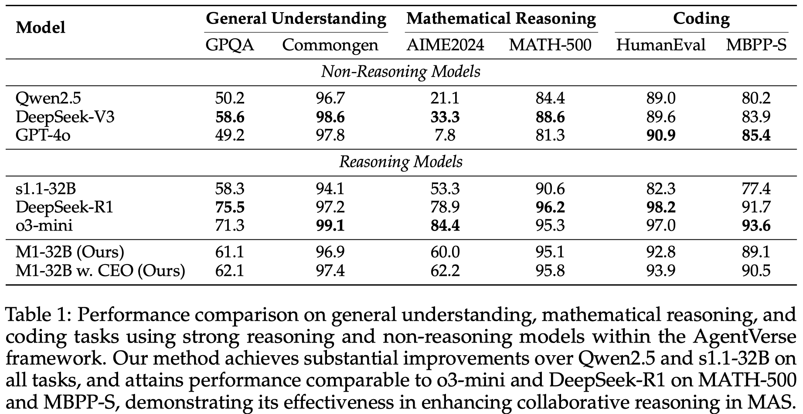

# [Two Heads are Better Than One: Test-time Scaling of Multi-agent Collaborative Reasoning](https://arxiv.org/pdf/2504.09772)
[](https://github.com/jincan333/MAS-TTS)

We introduce an adaptive multi-agent framework designed to enhance collaborative reasoning through both model-level training and system-level coordination.

> 🔗 [Paper](https://arxiv.org/pdf/2504.09772)  
> 🔗 [Project Page](https://github.com/jincan333/MAS-TTS)  
> 📦 [Model (M1-32B)](https://huggingface.co/Can111/m1-32b)  
> 📚 [Dataset (M500)](https://huggingface.co/datasets/Can111/m500)

## Table of Contents

- [Overview](#overview)
- [Configure Environment](#configure-environment-variables-and-api-keys)
- [Install Requirements](#install-requirements)
- [Configure Model and Dataset](#configure-model-and-dataset)
- [Train and Inference](#train-and-inference)
- [Contributor](#contributors)
- [Citation](#citation)


## Overview

Multi-agent systems (MAS) built on large language models (LLMs) offer a promising path toward solving complex, real-world tasks that single-agent systems often struggle to manage. While recent advancements in test-time scaling (TTS) have significantly improved single-agent performance on challenging reasoning tasks, how to effectively scale collaboration and reasoning in MAS remains an open question. In this work, we introduce an adaptive multi-agent framework designed to enhance collaborative reasoning through both model-level training and system-level coordination. We construct M500, a high-quality dataset containing 500 multi-agent collaborative reasoning traces, and fine-tune Qwen2.5-32B-Instruct on this dataset to produce M1-32B, a model optimized for multi-agent collaboration. To further enable adaptive reasoning, we propose a novel CEO agent that dynamically manages the discussion process, guiding agent collaboration and adjusting reasoning depth for more effective problem-solving. Evaluated in an open-source MAS across a range of tasks—including general understanding, mathematical reasoning, and coding—our system significantly outperforms strong baselines. For instance, M1-32B achieves 12\% improvement on GPQA-Diamond, 41\% on AIME2024, and 10\% on MBPP-Sanitized, matching the performance of state-of-the-art models like DeepSeek-R1 on some tasks. These results highlight the importance of both learned collaboration and adaptive coordination in scaling multi-agent reasoning. 

Authors: [Can Jin](https://jincan333.github.io/), Hongwu Peng, Qixin Zhang, Yujin Tang, Dimitris N. Metaxas, Tong Che


Note that the results of s1.1-32B are obtained without using budget forcing. 

## Configure Environment Variables and API Keys
Adding environment variables to ~/.bashrc:
```bash
export MY_HOME=
export MY_PROJECT=MAS-TTS
export MY_OUTPUT=
export OPENAI_API_KEY=
export TOGETHER_API_KEY=
export TOGETHER_BASE_URL=
export DEEPSEEK_BASE_URL=
export DEEPSEEK_API_KEY=
export WANDB_USER_NAME=
export WANDB_API_KEY=
export HUGGING_FACE_HUB_TOKEN=
export HUGGING_FACE_USER_NAME=
```
```bash
source ~/.bashrc
```

## Install Requirements: 
Installing requirements for the MAS (Agentverse):
```bash
# Create and activate conda environment
conda create -n agent python=3.11
conda activate agent
cd $MY_PROJECT
pip install -e .
python -m spacy download en_core_web_sm
```

Installing requirements for Model Training (LLaMA-Factory):
```bash
conda create -n llamafactory python=3.11
conda activate llamafactory
cd $MY_PROJECT/LLaMA-Factory
pip install -e ".[torch,metrics]"
pip install vllm deepspeed flash-attn wandb
```

## Configure Model and Dataset
Download the M1-32B model and M500 dataset:
M1-32B is at https://huggingface.co/Can111/m1-32b
M500 is at https://huggingface.co/datasets/Can111/m500

If you want to configure new models and datasets, please refer to the following instructions:

Config new models: gpt-4o-mini, o3-mini, deepseek-chat, deepseek-reasoner, Qwen, etc.
```
# local models
add config in `agentverse/llms/__init__.py`


# remote models
add config in `agentverse/llms/openai.py`
```

Config new datasets:
Add new datasets or tasks: AIME 2024, MATH-500, GPQA-Diamond, etc.
```
# data
add data in the `data` folder

# tasks
register tasks in `dataloader/__init__.py`

# configs
add configs in `agentverse/tasks/tasksolving`
```

For more detailed instructions, please refer to the [Agentverse](https://github.com/OpenBMB/AgentVerse) repository.

## Train and Inference

Train the model on M500 dataset:
```bash
bash run/train.sh
```

Inference the model using MAS on a task:
```bash
bash run/inference.sh
```


## Contributors
The MAS framework is built on the [Agentverse](https://github.com/OpenBMB/AgentVerse) repository.

## Citation
Consider citing our paper if you find our work useful.
```bibtex
@article{jin2025two,
  title={Two Heads are Better Than One: Test-time Scaling of Multi-agent Collaborative Reasoning},
  author={Jin, Can and Peng, Hongwu and Zhang, Qixin and Tang, Yujin and Metaxas, Dimitris N and Che, Tong},
  journal={arXiv preprint arXiv:2504.09772},
  year={2025}
}
```